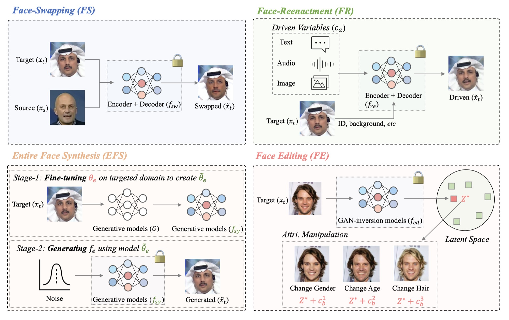

# DF40: Toward Next-Generation Deepfake Detection

Welcome to our work *DF40*, for next-generation deepfake detection. 

   

**DF40 Dataset Highlight:**. The key features of our proposed **DF40 dataset** are as follows:

> ✅ **Forgery Diversity**: *DF40* comprises **40** distinct deepfake techniques (both representive and SOTA methods are included), facilialting the detection of nowadays' SOTA deepfakes and AIGCs. We provide **10** face-swapping methods, **13** face-reenactment methods, **12** entire face synthesis methods, and **5** face editing.
> 
> ✅ **Forgery Realism**: *DF40* includes realistic deepfake data created by highly popular generation software and methods, *e.g.,* HeyGen, MidJourney, DeepFaceLab, to simulate real-world deepfakes. We even include the just-released DiT, SiT, PixArt-$\alpha$, etc.
> 
> ✅ **Forgery Scale**: *DF40* offers **million-level** deepfake data scale for both images and videos.

The figure below provides a brief introduction to our DF40 dataset.

 

  

---

The following two figures display the statistical description and illustrate the details of our DF40 dataset. **Please check our paper for details.**

 

  

 

  

---

The figure below shows the pipeline of four generation methods used in our DF40 dataset.

 

  

## 💥 DF40 Dataset
| Type                    | ID-Number | Method        | Download Link | Visual Examples |
|-------------------------|-----------|---------------|---------------|-----------------|
| Face-swapping (FS)      | 1         | FSGAN         |Coming Soon               |                 |
|                         | 2         | FaceSwap      |Coming Soon               |                 |
|                         | 3         | SimSwap       |Coming Soon               |                 |
|                         | 4         | InSwapper     |Coming Soon               |                 |
|                         | 5         | BlendFace     |Coming Soon               |                 |
|                         | 6         | UniFace       |Coming Soon               |                 |
|                         | 7         | MobileSwap    |Coming Soon               |                 |
|                         | 8         | e4s           |Coming Soon               |                 |
|                         | 9         | FaceDancer    |Coming Soon               |                 |
|                         | 10        | DeepFaceLab   |Coming Soon               |                |
| Face-reenactment (FR)   | 11        | FOMM          |Coming Soon               |                 |
|                         | 12        | FS_vid2vid    |Coming Soon               |                 |
|                         | 13        | Wav2Lip       |Coming Soon               |                 |
|                         | 14        | MRAA          |Coming Soon               |                 |
|                         | 15        | OneShot       |Coming Soon               |                 |
|                         | 16        | PIRender      |Coming Soon               |                 |
|                         | 17        | TPSM         |Coming Soon               |                 |
|                         | 18        | LIA           |Coming Soon               |                 |
|                         | 19        | DaGAN         |Coming Soon               |                 |
|                         | 20        | SadTalker     |Coming Soon               |                 |
|                         | 21        | MCNet         |Coming Soon               |                 |
|                         | 22        | HyperReenact  |Coming Soon               |                 |
|                         | 23        | HeyGen        |Coming Soon               |                 |
| Entire Face Synthesis (EFS) | 24    | VQGAN         |Coming Soon               |                 |
|                         | 25        | StyleGAN2     |Coming Soon               |                 |
|                         | 26        | StyleGAN3     |Coming Soon               |                 |
|                         | 27        | StyleGAN-XL   |Coming Soon               |                 |
|                         | 28        | SD-2.1        |Coming Soon               |                 |
|                         | 29        | DDPM          |Coming Soon               |                 |
|                         | 30        | RDDM          |Coming Soon               |                 |
|                         | 31        | PixArt-$\alpha$ |Coming Soon             |                 |
|                         | 32        | DiT-XL/2      |Coming Soon               |                  |
|                         | 33        | SiT-XL/2      |Coming Soon               |                 |
|                         | 34        | MidJounery6   |Coming Soon               |                 |
|                         | 35        | WhichisReal   |Coming Soon               |                 |
| Face Edit (FE)          | 36        | CollabDiff    |Coming Soon               |                 |
|                         | 37        | e4e           |Coming Soon               |                 |
|                         | 38        | StarGAN       |Coming Soon               |                 |
|                         | 39        | StarGANv2     |Coming Soon               |                 |
|                         | 40        | StyleCLIP     |Coming Soon               |                 |

## 👀 Visual examples
<a href="#top">[Back to top]</a>

1. Example samples created by **FS (face-swapping)** methods:

 

  

2. Example samples created by **FR (face-reenactment)** methods:

 

  

3. Example samples created by **EFS (entire face synthesis)** methods:

 

  

4. Example samples created by **FE (face editing)** methods:

 

  

