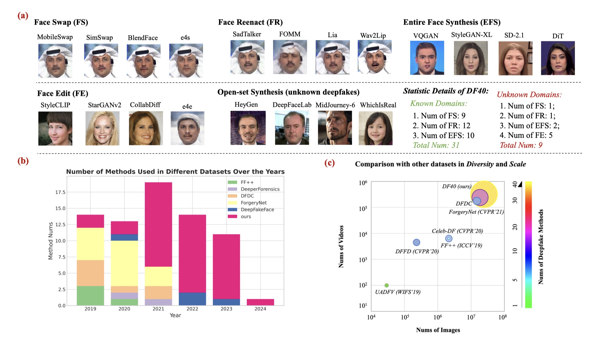

# DF40: Toward Next-Generation Deepfake Detection ([Project Page](https://yzy-stack.github.io/homepage_for_df40/); [Paper](https://arxiv.org/abs/2406.13495); [Download DF40](https://docs.google.com/forms/d/1ESAWoWusOEGEEVnXCH_emv-wJqCYMhCbD6-85RMIoDk/edit); [Checkpoints](https://drive.google.com/drive/folders/1HDgIOutGw3jsFXwvSQYeDoVPAzgfYbyr?usp=drive_link))

[](https://creativecommons.org/licenses/by-nc/4.0/)   

> 🎉🎉🎉 **Our DF40 has been accepted by NeurIPS 2024 D&B track!**

Welcome to our work **DF40**, for next-generation deepfake detection. 

**In this work, we propose: (1) a **diverse deepfake dataset** with 40 distinct generations methods; and (2) a **comprehensive benchmark** for training, evaluation, and analysis.**


***"Expanding Your Evaluation with 40 distinct High-Quality Fake Data from the FF++ and CDF domains!!"***

**DF40 Dataset Highlight:** The key features of our proposed **DF40 dataset** are as follows

> ✅ **Forgery Diversity**: *DF40* comprises **40** distinct deepfake techniques (both representive and SOTA methods are included), facilitating the detection of nowadays' SOTA deepfakes and AIGCs. We provide **10** face-swapping methods, **13** face-reenactment methods, **12** entire face synthesis methods, and **5** face editing.
> 
> ✅ **Forgery Realism**: *DF40* includes realistic deepfake data created by highly popular generation software and methods, *e.g.,* HeyGen, MidJourney, DeepFaceLab, to simulate real-world deepfakes. We even include the just-released DiT, SiT, PixArt-$\alpha$, etc.
> 
> ✅ **Forgery Scale**: *DF40* offers **million-level** deepfake data scale for both images and videos.
> > 
> ✅ **Data Alignment**: *DF40* provides alignment between fake methods and data domains. Most methods (31) are generated under the FF++ and CDF domains. Using our fake data, you can further expand your evaluation (training on FF++ and testing on CDF).

The figure below provides a brief introduction to our DF40 dataset.

<div align="center"> 
</div>
<div style="text-align:center;">
  
</div>


---


The following table displays the statistical description and illustrates the details of our DF40 dataset. **Please check our paper for details.**

<div align="center"> 
</div>
<div style="text-align:center;">
  
</div>


---


## 💥 DF40 Dataset
| Type                    | ID-Number | Generation Method        | Original Data Source | Visual Examples |
|-------------------------|-----------|---------------|---------------|-----------------|
| Face-swapping (FS)      | 1         | FSGAN         |[FF++](https://github.com/ondyari/FaceForensics) and [Celeb-DF](https://github.com/yuezunli/celeb-deepfakeforensics)               |  [](https://github.com/YZY-stack/temp_40_pangu/releases/download/visual_example/fsgan.gif)               |
|  Face-swapping (FS)                        | 2         | FaceSwap      |[FF++](https://github.com/ondyari/FaceForensics) and [Celeb-DF](https://github.com/yuezunli/celeb-deepfakeforensics)               |  [](https://github.com/YZY-stack/temp_40_pangu/releases/download/visual_example/faceswap.gif)               |
|   Face-swapping (FS)                       | 3         | SimSwap       |[FF++](https://github.com/ondyari/FaceForensics) and [Celeb-DF](https://github.com/yuezunli/celeb-deepfakeforensics)               |  [](https://github.com/YZY-stack/temp_40_pangu/releases/download/visual_example/simswap.gif)               |
|    Face-swapping (FS)                      | 4         | InSwapper     |[FF++](https://github.com/ondyari/FaceForensics) and [Celeb-DF](https://github.com/yuezunli/celeb-deepfakeforensics)              |  [](https://github.com/YZY-stack/temp_40_pangu/releases/download/visual_example/inswap.gif)               |
|    Face-swapping (FS)                      | 5         | BlendFace     |[FF++](https://github.com/ondyari/FaceForensics) and [Celeb-DF](https://github.com/yuezunli/celeb-deepfakeforensics)               |   [](https://github.com/YZY-stack/temp_40_pangu/releases/download/visual_example/blendface.gif)              |
|   Face-swapping (FS)                       | 6         | UniFace       |[FF++](https://github.com/ondyari/FaceForensics) and [Celeb-DF](https://github.com/yuezunli/celeb-deepfakeforensics)               |   [](https://github.com/YZY-stack/temp_40_pangu/releases/download/visual_example/uniface.gif)              |
|    Face-swapping (FS)                      | 7         | MobileSwap    |[FF++](https://github.com/ondyari/FaceForensics) and [Celeb-DF](https://github.com/yuezunli/celeb-deepfakeforensics)               |   [](https://github.com/YZY-stack/temp_40_pangu/releases/download/visual_example/mobileswap.gif)              |
|    Face-swapping (FS)                      | 8         | e4s           |[FF++](https://github.com/ondyari/FaceForensics) and [Celeb-DF](https://github.com/yuezunli/celeb-deepfakeforensics)               |   [](https://github.com/YZY-stack/temp_40_pangu/releases/download/visual_example/e4s.gif)              |
|   Face-swapping (FS)                       | 9         | FaceDancer    |[FF++](https://github.com/ondyari/FaceForensics) and [Celeb-DF](https://github.com/yuezunli/celeb-deepfakeforensics)               |    [](https://github.com/YZY-stack/temp_40_pangu/releases/download/visual_example/facedancer.gif)             |
|   Face-swapping (FS)                       | 10        | DeepFaceLab   |[UADFV](https://docs.google.com/forms/d/e/1FAIpQLScKPoOv15TIZ9Mn0nGScIVgKRM9tFWOmjh9eHKx57Yp-XcnxA/viewform?usp=send_form)               |    [](https://github.com/YZY-stack/temp_40_pangu/releases/download/visual_example/deepfacelab.gif)            |
| Face-reenactment (FR)   | 11        | FOMM          |[FF++](https://github.com/ondyari/FaceForensics) and [Celeb-DF](https://github.com/yuezunli/celeb-deepfakeforensics)               |    [](https://github.com/YZY-stack/temp_40_pangu/releases/download/visual_example/fomm.gif)             |
|  Face-reenactment (FR)                       | 12        | FS_vid2vid    |[FF++](https://github.com/ondyari/FaceForensics) and [Celeb-DF](https://github.com/yuezunli/celeb-deepfakeforensics)               |    [](https://github.com/YZY-stack/temp_40_pangu/releases/download/visual_example/face_vid2vid.gif)             |
|   Face-reenactment (FR)                      | 13        | Wav2Lip       |[FF++](https://github.com/ondyari/FaceForensics) and [Celeb-DF](https://github.com/yuezunli/celeb-deepfakeforensics)               |    [](https://github.com/YZY-stack/temp_40_pangu/releases/download/visual_example/wav2lip.gif)             |
|   Face-reenactment (FR)                      | 14        | MRAA          |[FF++](https://github.com/ondyari/FaceForensics) and [Celeb-DF](https://github.com/yuezunli/celeb-deepfakeforensics)               |    [](https://github.com/YZY-stack/temp_40_pangu/releases/download/visual_example/mraa.gif)             |
|   Face-reenactment (FR)                      | 15        | OneShot       |[FF++](https://github.com/ondyari/FaceForensics) and [Celeb-DF](https://github.com/yuezunli/celeb-deepfakeforensics)               |    [](https://github.com/YZY-stack/temp_40_pangu/releases/download/visual_example/oneshot.gif)             |
|   Face-reenactment (FR)                      | 16        | PIRender      |[FF++](https://github.com/ondyari/FaceForensics) and [Celeb-DF](https://github.com/yuezunli/celeb-deepfakeforensics)               |    [](https://github.com/YZY-stack/temp_40_pangu/releases/download/visual_example/pirender.gif)             |
|   Face-reenactment (FR)                      | 17        | TPSM         |[FF++](https://github.com/ondyari/FaceForensics) and [Celeb-DF](https://github.com/yuezunli/celeb-deepfakeforensics)               |    [](https://github.com/YZY-stack/temp_40_pangu/releases/download/visual_example/tpsm.gif)             |
|   Face-reenactment (FR)                      | 18        | LIA           |[FF++](https://github.com/ondyari/FaceForensics) and [Celeb-DF](https://github.com/yuezunli/celeb-deepfakeforensics)               |    [](https://github.com/YZY-stack/temp_40_pangu/releases/download/visual_example/lia.gif)             |
|   Face-reenactment (FR)                      | 19        | DaGAN         |[FF++](https://github.com/ondyari/FaceForensics) and [Celeb-DF](https://github.com/yuezunli/celeb-deepfakeforensics)               |    [](https://github.com/YZY-stack/temp_40_pangu/releases/download/visual_example/dagan.gif)             |
|   Face-reenactment (FR)                      | 20        | SadTalker     |[FF++](https://github.com/ondyari/FaceForensics) and [Celeb-DF](https://github.com/yuezunli/celeb-deepfakeforensics)               |    [](https://github.com/YZY-stack/temp_40_pangu/releases/download/visual_example/sadtalker.gif)             |
|   Face-reenactment (FR)                      | 21        | MCNet         |[FF++](https://github.com/ondyari/FaceForensics) and [Celeb-DF](https://github.com/yuezunli/celeb-deepfakeforensics)               |    [](https://github.com/YZY-stack/temp_40_pangu/releases/download/visual_example/mcnet.gif)             |
|   Face-reenactment (FR)                      | 22        | HyperReenact  |[FF++](https://github.com/ondyari/FaceForensics) and [Celeb-DF](https://github.com/yuezunli/celeb-deepfakeforensics)               |     [](https://github.com/YZY-stack/temp_40_pangu/releases/download/visual_example/hyperreenact.gif)            |
|    Face-reenactment (FR)                     | 23        | HeyGen        |[FVHQ](https://liangbinxie.github.io/projects/vfhq/)               |     [](https://github.com/YZY-stack/temp_40_pangu/releases/download/visual_example/heygen.gif)            |
| Entire Face Synthesis (EFS) | 24    | VQGAN         |Finetuning on [FF++](https://github.com/ondyari/FaceForensics) and [Celeb-DF](https://github.com/yuezunli/celeb-deepfakeforensics)               |     [](https://github.com/YZY-stack/temp_40_pangu/releases/download/visual_example/vqgan.png)            |
| Entire Face Synthesis (EFS)                        | 25        | StyleGAN2     |Finetuning on [FF++](https://github.com/ondyari/FaceForensics) and [Celeb-DF](https://github.com/yuezunli/celeb-deepfakeforensics)               |     [](https://github.com/YZY-stack/temp_40_pangu/releases/download/visual_example/stylegan2.png)            |
| Entire Face Synthesis (EFS)                        | 26        | StyleGAN3     |Finetuning on [FF++](https://github.com/ondyari/FaceForensics) and [Celeb-DF](https://github.com/yuezunli/celeb-deepfakeforensics)               |     [](https://github.com/YZY-stack/temp_40_pangu/releases/download/visual_example/stylegan3.png)            |
|  Entire Face Synthesis (EFS)                       | 27        | StyleGAN-XL   |Finetuning on [FF++](https://github.com/ondyari/FaceForensics) and [Celeb-DF](https://github.com/yuezunli/celeb-deepfakeforensics)               |     [](https://github.com/YZY-stack/temp_40_pangu/releases/download/visual_example/styleganxl.png)            |
|  Entire Face Synthesis (EFS)                       | 28        | SD-2.1        |Finetuning on [FF++](https://github.com/ondyari/FaceForensics) and [Celeb-DF](https://github.com/yuezunli/celeb-deepfakeforensics)               |      [](https://github.com/YZY-stack/temp_40_pangu/releases/download/visual_example/sd2.1.png)           |
|  Entire Face Synthesis (EFS)                       | 29        | DDPM          |Finetuning on [FF++](https://github.com/ondyari/FaceForensics) and [Celeb-DF](https://github.com/yuezunli/celeb-deepfakeforensics)               |      [](https://github.com/YZY-stack/temp_40_pangu/releases/download/visual_example/ddim.png)           |
|  Entire Face Synthesis (EFS)                       | 30        | RDDM          |Finetuning on [FF++](https://github.com/ondyari/FaceForensics) and [Celeb-DF](https://github.com/yuezunli/celeb-deepfakeforensics)               |      [](https://github.com/YZY-stack/temp_40_pangu/releases/download/visual_example/rddm.png)           |
|  Entire Face Synthesis (EFS)                       | 31        | PixArt-$\alpha$ |Finetuning on [FF++](https://github.com/ondyari/FaceForensics) and [Celeb-DF](https://github.com/yuezunli/celeb-deepfakeforensics)             |        [](https://github.com/YZY-stack/temp_40_pangu/releases/download/visual_example/pixart.png)         |
|  Entire Face Synthesis (EFS)                       | 32        | DiT-XL/2      |Finetuning on [FF++](https://github.com/ondyari/FaceForensics) and [Celeb-DF](https://github.com/yuezunli/celeb-deepfakeforensics)               |       [](https://github.com/YZY-stack/temp_40_pangu/releases/download/visual_example/dit.png)           |
|  Entire Face Synthesis (EFS)                       | 33        | SiT-XL/2      |Finetuning on [FF++](https://github.com/ondyari/FaceForensics) and [Celeb-DF](https://github.com/yuezunli/celeb-deepfakeforensics)               |       [](https://github.com/YZY-stack/temp_40_pangu/releases/download/visual_example/sit.png)          |
|  Entire Face Synthesis (EFS)                       | 34        | MidJounery6   |[FFHQ](https://github.com/NVlabs/ffhq-dataset)               |      [](https://github.com/YZY-stack/temp_40_pangu/releases/download/visual_example/mj.png)           |
|  Entire Face Synthesis (EFS)                       | 35        | WhichisReal   |[FFHQ](https://github.com/NVlabs/ffhq-dataset)               |      [](https://github.com/YZY-stack/temp_40_pangu/releases/download/visual_example/whichisreal.png)           |
| Face Edit (FE)          | 36        | CollabDiff    |[CelebA](https://mmlab.ie.cuhk.edu.hk/projects/CelebA.html)               |       [](https://github.com/YZY-stack/temp_40_pangu/releases/download/visual_example/collabdiff.png)          |
| Face Edit (FE)                        | 37        | e4e           |[CelebA](https://mmlab.ie.cuhk.edu.hk/projects/CelebA.html)               |       [](https://github.com/YZY-stack/temp_40_pangu/releases/download/visual_example/e4e.jpg)          |
|  Face Edit (FE)                       | 38        | StarGAN       |[CelebA](https://mmlab.ie.cuhk.edu.hk/projects/CelebA.html)               |       [](https://github.com/YZY-stack/temp_40_pangu/releases/download/visual_example/stargan.jpg)          |
|  Face Edit (FE)                       | 39        | StarGANv2     | [CelebA](https://mmlab.ie.cuhk.edu.hk/projects/CelebA.html)               |                 |
|  Face Edit (FE)                       | 40        | StyleCLIP     |[CelebA](https://mmlab.ie.cuhk.edu.hk/projects/CelebA.html)              |       [](https://github.com/YZY-stack/temp_40_pangu/releases/download/visual_example/styleclip.jpg)          |


## ⏳ Quick Start
<a href="#top">[Back to top]</a>


### 1. Installation
Please run the following script to install the required libraries:

```
sh install.sh
```

### 2. Download ckpts for inference
All checkpoints/weights of ten models training on our DF40 are released at [Google Drive](https://drive.google.com/drive/folders/1HDgIOutGw3jsFXwvSQYeDoVPAzgfYbyr?usp=drive_link) and [Baidu Disk](https://pan.baidu.com/s/1X4R32ZgJD8aX0nhnB9G33g?pwd=dqs7). 

Note that:
- If your want to use the CLIP model that is trained on all FS methods of DF40, you can find it at `df40_weights/train_on_fs/clip.pth`. You can use all ckpts under `df40_weights/train_on_xxx_matrix` to reproduce the results of **Protocol-1,2,3** of our paper.
- Similarly, if you want to use the Xception model that is trained **specifically** on the SimSwap method, you can find it in the folder `df40_weights/train_on_fs_matrix/simswap_ff.pth`. You can use all ckpts under `df40_weights/train_on_xxx_matrix` to reproduce the results of **Protocol-4** of our paper.


### 3. Download DF40 data (after pre-processing)
For quick use and convenience, we provide all DF40 data after pre-processing using in our research. You do **NOT need to do the pre-processing again** but directly use our processed data.
- DF40 (testing data):.
  - Description: We provide the [Google Drive Link](https://drive.google.com/drive/folders/1980LCMAutfWvV6zvdxhoeIa67TmzKLQ_?usp=drive_link) and [Baidu Disk](https://pan.baidu.com/s/1cSHIggvBz7i2kkhtiNBbgg?pwd=vija) of the whole DF40 testing data (40 methods) after preprocessing (frame extraction and face cropping), including **fake images only.**
  - Size: The whole size is **~93G**, including all testing fake data of DF40.
- DF40 (training data):
  - Description: Similar to the DF40-test, we provide the processed fake images for training in [Google Drive Link](https://drive.google.com/drive/folders/1U8meBbqVvmUkc5GD0jxct6xe6Gwk9wKD?usp=sharing) and [Baidu Disk](https://pan.baidu.com/s/1XYGsgBf8lrqiNHfm0enNGQ?pwd=russ). Please note that the training set ONLY includes the "known" methods and utilizes the FaceForensics++ (ff) domain for training. The Celeb-DF (cdf) domain is not used for training purposes but for testing only.
  - Size: The whole size is **~50G**, including all training fake data of DF40 (only the FF++ domain).
- Original Real Data (FF++ and Celeb-DF):
  - **For "known" 31 methods:** To obtain the **real data** for both training and testing purposes, please use the following links: FaceForensics++ real data ([Google Drive Link](https://drive.google.com/file/d/1dHJdS0NZ6wpewbGA5B0PdIBS9gz28pdb/view?usp=drive_link) and [Baidu Disk](https://pan.baidu.com/s/1keh8-LWO05KvR-Nw_fnURQ?pwd=tism)) and Celeb-DF real data ([Google Drive Link](https://drive.google.com/file/d/1FGZ3aYsF-Yru50rPLoT5ef8-2Nkt4uBw/view?usp=sharing) and [Baidu Disk](https://pan.baidu.com/s/1CL3bi7Phi2CvaPXARXvMCA?pwd=8gmu)).
  - **For the "unknown" 9 methods:** The real data is **already included within the folder**, so there is **NO** additional download link required for the real data of the unknown methods.
- JSON files for recording image paths:
  - Description: we create a JSON file to load all frame paths for each method in a unified way.
  - All the JSON files used in our research can be downloaded here ([Google Drive](https://drive.google.com/drive/folders/19VhAL4aDJOKvhl9stEq_ymFeHiXo6_j-?usp=drive_link) and [Baidu Disk](https://pan.baidu.com/s/1rSfgVL7zguVOK6eZGACHPA?pwd=t4a7)). 
  - After downloading, Please put the folder `dataset_json` inside the `./preprocessing/ folder.


### 3. Run inference
You can then run inference using the trained weights used in our research. 

> **Example-1:** If you want to use the Xception model trained on SimSwap (FF) and test it on BlendFace (FF), run the following line. 

```
cd DeepfakeBench_DF40

python training/test.py \
--detector_path training/config/detector/xception.yaml \
--weights_path training/df40_weights/train_on_fs_matrix/simswap_ff.pth  \
--test_dataset blendface_ff
```


> **Example-2:** If you want to use the Xception model trained on SimSwap (FF) and test it on SimSwap (CDF), run the following line. 

```
cd DeepfakeBench_DF40

python training/test.py \
--detector_path training/config/detector/xception.yaml \
--weights_path training/df40_weights/train_on_fs_matrix/simswap_ff.pth  \
--test_dataset simswap_cdf
```


> **Example-3:** If you want to use the CLIP model trained on all methods of FS (FF) and test it on DeepFaceLab, run the following line. 

```
cd DeepfakeBench_DF40

python training/test.py \
--detector_path training/config/detector/clip.yaml \
--weights_path training/df40_weights/train_on_fs/clip.pth  \
--test_dataset deepfacelab
```


## 💻 Reproduction and Development

<a href="#top">[Back to top]</a>


### 1. Download DF40 dataset

We provide two ways to download our dataset:
- **Option-1**: Using the processed data after preprocessing that used also in our research. Please see the `Quick Start` part;
- **Option-2**: If you also want to download the **original fake videos of all FS and FR methods**, please download them at the link ([Google Drive](https://drive.google.com/drive/folders/1GB3FN4pjf9Q5hhhcBmBTdMmEmtrDe9zZ?usp=drive_link)). For EFS and FE methods, the original data is the processed data, they are the same since they do not need to perform preprocessing (e.g., frame extraction and face crop).


### 2. Preprocessing (**optional**)

**If you only want to use the processed data we provided, you can skip this step. Otherwise, you need to use the following codes for doing data preprocessing.**

To start preprocessing DF40 dataset, please follow these steps:

1. Open the `./preprocessing/config.yaml` and locate the line `default: DATASET_YOU_SPECIFY`. Replace `DATASET_YOU_SPECIFY` with the name of the dataset you want to preprocess, such as `FaceForensics++`.

2. Specify the `dataset_root_path` in the config.yaml file. Search for the line that mentions dataset_root_path. By default, it looks like this: ``dataset_root_path: ./datasets``.
Replace `./datasets` with the actual path to the folder where your dataset is arranged. 

Once you have completed these steps, you can proceed with running the following line to do the preprocessing:

```
cd preprocessing

python preprocess.py
```


### 3. Rearrangement (**optional**)

> "Rearrangment" here means that we need to create a JSON file for each dataset for collecting all frames within different folders.

**If you only want to use the processed data we provided, you can skip this step and use the JSON files we used in our research ([Google Drive](https://drive.google.com/drive/folders/1rh-82Rn0pqQ7xzLDKBv9gdjy-sbxYC8-?usp=sharing)). Otherwise, you need to use the following codes for doing data rearrangement.**

After the preprocessing above, you will obtain the processed data (*e.g., frames, landmarks, and masks*) for each dataset you specify. Similarly, you need to set the parameters in `./preprocessing/config.yaml` for each dataset. After that, run the following line:
```
cd preprocessing

python rearrange.py
```
After running the above line, you will obtain the JSON files for each dataset in the `./preprocessing/dataset_json` folder. The rearranged structure organizes the data in a hierarchical manner, grouping videos based on their labels and data splits (*i.e.,* train, test, validation). Each video is represented as a dictionary entry containing relevant metadata, including file paths, labels, compression levels (if applicable), *etc*. 


### 4. Training
Our benchmark includes four standarad protocols. You can use the following examples of each protocol to train the models:

**(a). Protocol-1: Same Data Domain, Differenet Forgery Types**

First, you can run the following lines to train a model (*e.g.,* if you want to train the Xception model on all FS methods):
- For multiple GPUs:
```
python3 -m torch.distributed.launch --nproc_per_node=8 training/train.py \
--detector_path ./training/config/detector/xception.yaml \
--train_dataset FSAll_ff \
--test_dataset FSAll_ff \
--ddp
```
- For a single GPU:
```
python3 training/train.py \
--detector_path ./training/config/detector/xception.yaml \
--train_dataset FSAll_ff \
--test_dataset FSAll_ff \
```

Note, we here perform both training and evaluating on FSAll_ff (using all *testing* FS methods of *FF domain* as the evaluation set) to select the best checkpoint. Once finished training, you can use the best checkpoint to evaluate other testing datasets (e.g., all testing EFS and FR methods of the FF domain). Specifically:

```
python3 training/test.py \
--detector_path ./training/config/detector/xception.yaml \
--test_dataset "FSAll_ff" "FRAll_ff" "EFSAll_ff" \
--weights_path ./training/df40_weights/train_on_fs/xception.pth
```
Then, you can obtain similar evaluation results reported in **Tab. 3** of the manuscript.


**(b). Protocol-2: Same Forgery Types, Differenet Data Domain**
Similarly, you can run the following lines for Protocol-2.

```
python3 training/test.py \
--detector_path ./training/config/detector/xception.yaml \
--test_dataset "FSAll_cdf" "FRAll_cdf" "EFSAll_cdf" \
--weights_path ./training/df40_weights/train_on_fs/xception.pth
```
Then, you can obtain similar evaluation results reported in **Tab. 4** of the manuscript.


**(c). Protocol-3: Differenet Forgery Types, Differenet Data Domain**
Similarly, you can run the following lines for Protocol-3.

```
python3 training/test.py \
--detector_path ./training/config/detector/xception.yaml \
--test_dataset "deepfacelab" "heygen" "whichisreal" "MidJourney" "stargan" "starganv2" "styleclip" "e4e" "CollabDiff" \
--weights_path ./training/df40_weights/train_on_fs/xception.pth
```
Then, you can obtain all evaluation results reported in **Tab. 5** of the manuscript.


**(c). Protocol-4: Train on one fake method and testing on all other methods (One-vs-All)**
Similarly, you should first train one model (e.g., Xception) on one specific fake method (e.g., SimSwap):

```
python3 training/train.py \
--detector_path ./training/config/detector/xception.yaml \
--train_dataset simswap_ff \
--test_dataset simswap_ff \
```

Then runing the following lines for evaluation:
```
python3 training/test.py \
--detector_path ./training/config/detector/xception.yaml \
--test_dataset ... (type them one-by-one) \
--weights_path ./training/df40_weights/train_on_fs_matrix/simswap_ff.pth
```
You can also directly use the **bash file** (`./training/test_df40.sh`) for convenience and then you do not need to type all fake methods one-by-one at the terminal.

Then, you can obtain all evaluation results reported in **Fig. 4** of the manuscript.


## 👀 More visual examples
<a href="#top">[Back to top]</a>

1. Example samples created by **FS (face-swapping)** methods: Please check [here](./df40_figs/df40_figs/fs_visual.png).

2. Example samples created by **FR (face-reenactment)** methods: Please check [here](./df40_figs/df40_figs/fr_visual.png).

3. Example samples created by **EFS (entire face synthesis)** methods: Please check [here](./df40_figs/df40_figs/efs_visual.png).

4. Example samples created by **FE (face editing)** methods: Please check [here](./df40_figs/df40_figs/unknown_visual.png).


## Folder Structure
```
deepfake_detection_datasets
│
├── DF40
│   ├── fsgan
│       ├── ff
│       └── cdf
│   ├── faceswap
│       ├── ff
│       └── cdf
│   ├── simswap
│       ├── ff
│       └── cdf
│   ├── inswap
│       ├── ff
│       └── cdf
│   ├── blendface
│       ├── ff
│       └── cdf
│   ├── uniface
│       ├── ff
│       └── cdf
│   ├── mobileswap
│       ├── ff
│       └── cdf
│   ├── e4s
│       ├── ff
│       └── cdf
│   ├── facedancer
│       ├── ff
│       └── cdf
│   ├── fomm
│       ├── ff
│       └── cdf
│   ├── facevid2vid
│       ├── ff
│       └── cdf
│   ├── wav2lip
│       ├── ff
│       └── cdf
│   ├── MRAA
│       ├── ff
│       └── cdf
│   ├── one_shot_free
│       ├── ff
│       └── cdf
│   ├── pirender
│       ├── ff
│       └── cdf
│   ├── tpsm
│       ├── ff
│       └── cdf
│   ├── lia
│       ├── ff
│       └── cdf
│   ├── danet
│       ├── ff
│       └── cdf
│   ├── sadtalker
│       ├── ff
│       └── cdf
│   ├── mcnet
│       ├── ff
│       └── cdf
│   ├── heygen
│       ├── fake
│       └── real
│   ├── VQGAN
│       ├── ff
│       └── cdf
│   ├── StyleGAN2
│       ├── ff
│       └── cdf
│   ├── StyleGAN3
│       ├── ff
│       └── cdf
│   ├── StyleGANXL
│       ├── ff
│       └── cdf
│   ├── sd2.1
│       ├── ff
│       └── cdf
│   ├── ddim
│       ├── ff
│       └── cdf
│   ├── PixArt
│       ├── ff
│       └── cdf
│   ├── DiT
│       ├── ff
│       └── cdf
│   ├── SiT
│       ├── ff
│       └── cdf
│   ├── MidJourney
│       ├── fake
│       └── real
│   ├── whichfaceisreal
│       ├── fake
│       └── real
│   ├── stargan
│       ├── fake
│       └── real
│   ├── starganv2
│       ├── fake
│       └── real
│   ├── styleclip
│       ├── fake
│       └── real
│   ├── e4e
│       ├── fake
│       └── real
│   └── CollabDiff
│       ├── fake
│       └── real
│  
├── DF40_train
│   ├── fsgan
│       ├── ff
│       └── cdf
│   ├── faceswap
│       ├── ff
│       └── cdf
│   ├── simswap
│       ├── ff
│       └── cdf
│   ├── inswap
│       ├── ff
│       └── cdf
│   ├── blendface
│       ├── ff
│       └── cdf
│   ├── uniface
│       ├── ff
│       └── cdf
│   ├── mobileswap
│       ├── ff
│       └── cdf
│   ├── e4s
│       ├── ff
│       └── cdf
│   ├── facedancer
│       ├── ff
│       └── cdf
│   ├── fomm
│       ├── ff
│       └── cdf
│   ├── facevid2vid
│       ├── ff
│       └── cdf
│   ├── wav2lip
│       ├── ff
│       └── cdf
│   ├── MRAA
│       ├── ff
│       └── cdf
│   ├── one_shot_free
│       ├── ff
│       └── cdf
│   ├── pirender
│       ├── ff
│       └── cdf
│   ├── tpsm
│       ├── ff
│       └── cdf
│   ├── lia
│       ├── ff
│       └── cdf
│   ├── danet
│       ├── ff
│       └── cdf
│   ├── sadtalker
│       ├── ff
│       └── cdf
│   ├── mcnet
│       ├── ff
│       └── cdf
│   ├── heygen
│       ├── ff
│       └── cdf
│   ├── VQGAN
│       ├── ff
│       └── cdf
│   ├── StyleGAN2
│       ├── ff
│       └── cdf
│   ├── StyleGAN3
│       ├── ff
│       └── cdf
│   ├── StyleGANXL
│       ├── ff
│       └── cdf
│   ├── sd2.1
│       ├── ff
│       └── cdf
│   ├── ddim
│       ├── ff
│       └── cdf
│   ├── PixArt
│       ├── ff
│       └── cdf
│   ├── DiT
│       ├── ff
│       └── cdf
│   ├── SiT
│       ├── ff
│       └── cdf
│   ├── MidJourney
│       ├── fake
│       └── real
│   ├── whichfaceisreal
│       ├── fake
│       └── real
│   ├── stargan
│       ├── fake
│       └── real
│   ├── starganv2
│       ├── fake
│       └── real
│   ├── styleclip
│       ├── fake
│       └── real
│   ├── e4e
│       ├── fake
│       └── real
│   └── CollabDiff
│       ├── fake
│       └── real
```


## Citations
If you use our DF40 dataset, checkpoints/weights, and codes in your research, you must cite DF40 as follows:

```
@article{yan2024df40,
  title={DF40: Toward Next-Generation Deepfake Detection},
  author={Yan, Zhiyuan and Yao, Taiping and Chen, Shen and Zhao, Yandan and Fu, Xinghe and Zhu, Junwei and Luo, Donghao and Yuan, Li and Wang, Chengjie and Ding, Shouhong and others},
  journal={arXiv preprint arXiv:2406.13495},
  year={2024}
}
```

Since our codebase is mainly based on [DeepfakeBench](https://github.com/SCLBD/DeepfakeBench), you should also cite it as follows:

```
@inproceedings{DeepfakeBench_YAN_NEURIPS2023,
 author = {Yan, Zhiyuan and Zhang, Yong and Yuan, Xinhang and Lyu, Siwei and Wu, Baoyuan},
 booktitle = {Advances in Neural Information Processing Systems},
 editor = {A. Oh and T. Neumann and A. Globerson and K. Saenko and M. Hardt and S. Levine},
 pages = {4534--4565},
 publisher = {Curran Associates, Inc.},
 title = {DeepfakeBench: A Comprehensive Benchmark of Deepfake Detection},
 url = {https://proceedings.neurips.cc/paper_files/paper/2023/file/0e735e4b4f07de483cbe250130992726-Paper-Datasets_and_Benchmarks.pdf},
 volume = {36},
 year = {2023}
}
```


## License
The use of both the dataset and codes is RESTRICTED to Creative Commons Attribution-NonCommercial 4.0 International Public License (CC BY-NC 4.0). See `https://creativecommons.org/licenses/by-nc/4.0/` for details.
